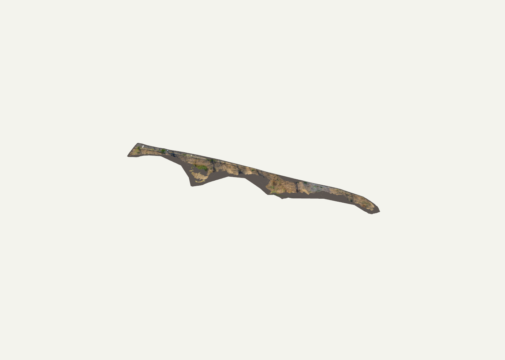
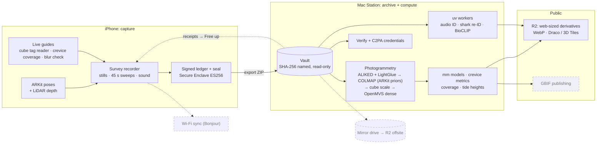
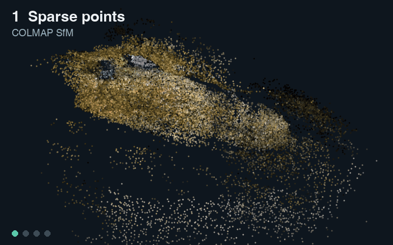
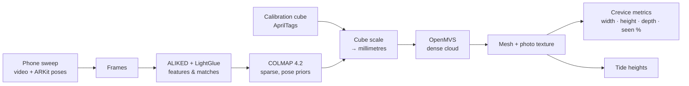
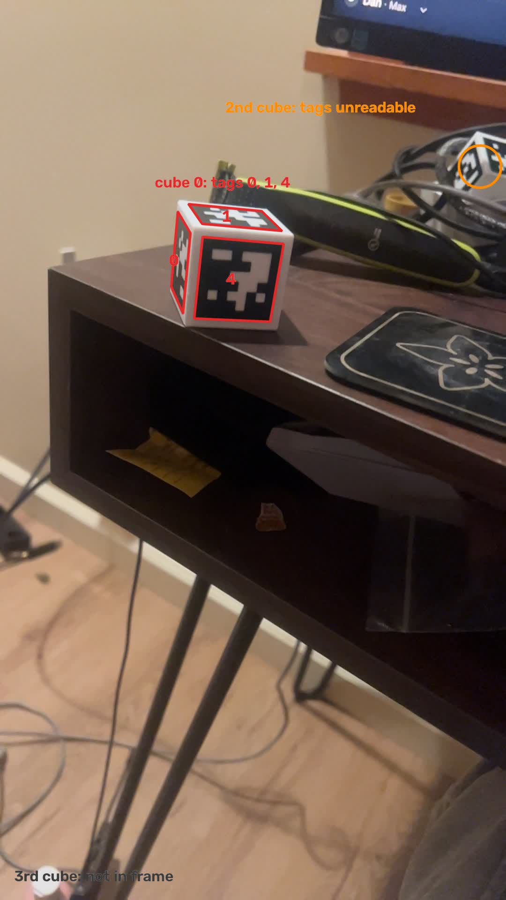
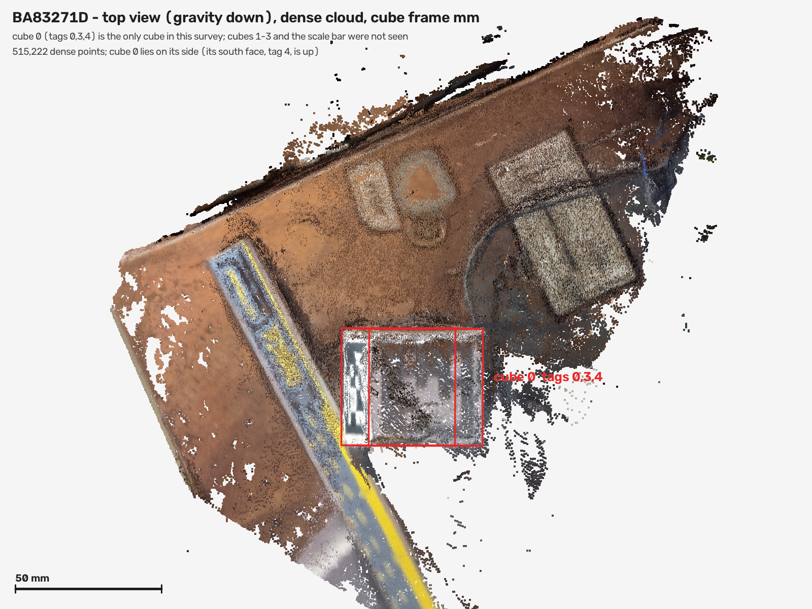
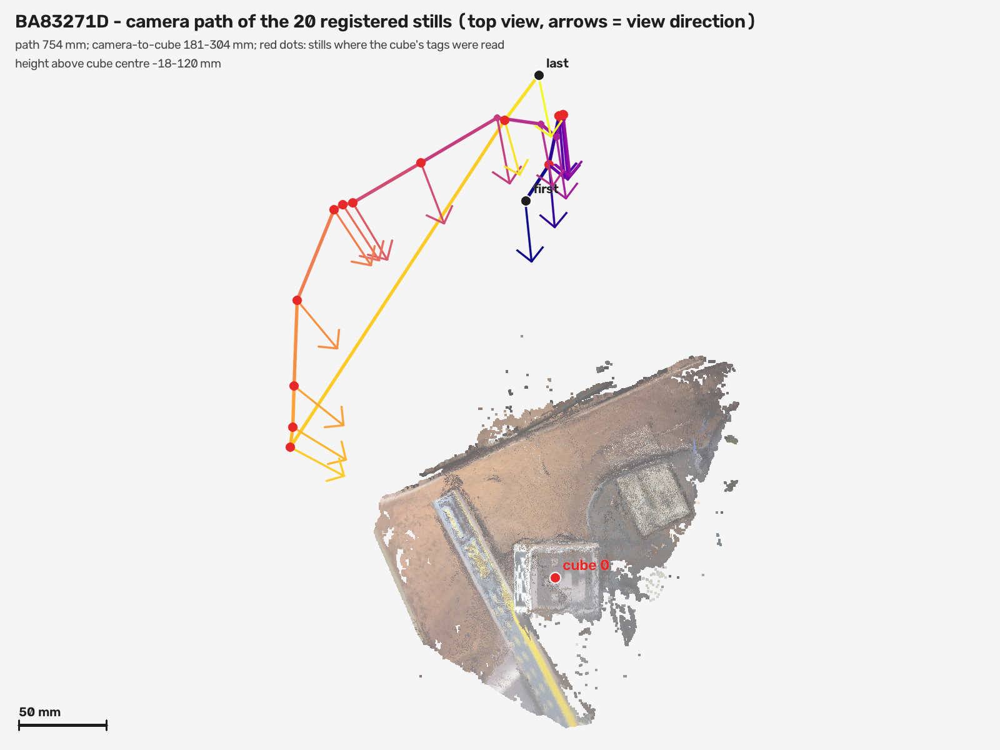
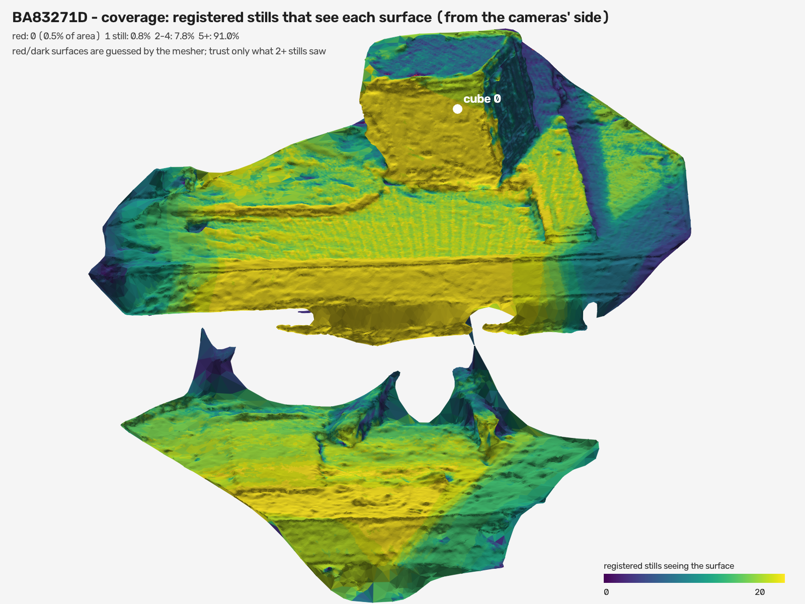
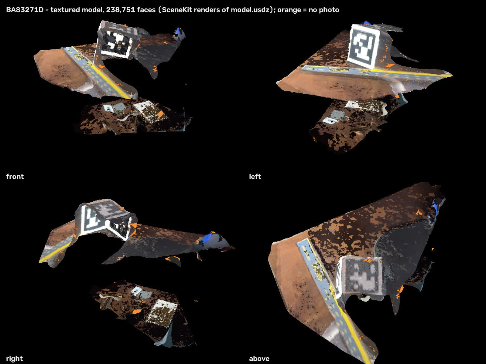

# TerraMesh

Walk a site with an iPhone, get a 3D habitat map with every photographed organism placed
in it, then refine it afterwards on a Mac or a field station.

> **Skeleton of an ongoing project.** This covers the planned architecture, the
> photogrammetry and the post-capture station workers: real module layout, signatures and
> docstrings, with every function body replaced by `...`. The iPhone app, footage, models
> and site data are left out. It does not run, but the plan and the docstrings are enough
> to build your own. You are welcome to; please credit Daniel Sambold if you do.

## Collaborate

I am looking for collaborators. What needs work:

- **Field accuracy.** Metric scale, geographic alignment and surface accuracy are not yet verified in the field; the cube-scaling gates need real site tests.
- **On-device testing** across iPhones, with and without LiDAR.
- **Planned pieces not built yet:** GBIF publishing, offsite mirroring and Wi-Fi sync.
- **Intertidal and cave sites**, and partners who survey them.

  
  
  
  

Beta testing needs an iPhone (LiDAR Pro models help most, but any recent iPhone is useful); I reply on the issue with next steps. The first buttons open a short public form (needs a GitHub account). No account, or rather keep it private? Email <a href="mailto:daniel.sambold@gmail.com">daniel.sambold@gmail.com</a> or message me on <a href="https://www.linkedin.com/in/daniel-sambold-620b37221">LinkedIn</a>.

First real-video test: one curb clip, 163 frames, all registered by Apple's native
photogrammetry into a textured preview (12,540 vertices). Metric scale and geographic
alignment are not yet verified.

A newer scan: an abalone cave, 23 September.

## Where it stands

- **Works today:** phone capture with ARKit poses and a signed evidence ledger; COLMAP and
  OpenMVS reconstruction on a Mac station (10.7 million dense points on the abalone cave);
  printed AprilTag cubes that set the scale; coverage maps and crevice metrics.
- **Not yet verified:** metric scale, geographic alignment and surface accuracy in the
  field. Treat every number here as a lab result until the field tests are done.
- **Planned, not built:** GBIF publishing, offsite mirroring and Wi-Fi sync (dashed below).

## Architecture now

Dashed boxes are planned, not built. Drawn from the current docs on 27 September.
[`docs/architecture.md`](docs/architecture.md) is the original 10 September design it grew
from (SwiftUI, ARKit, Core Location, Vision and Core ML, RealityKit; ARKit's visual-inertial
tracking for a metric route, LiDAR or multiple viewpoints to place an observation). Parts it
mentions, such as the app code, are not in this skeleton.

## Photogrammetry, stage by stage

The 23 September abalone cave from one fixed camera: COLMAP sparse points, the OpenMVS
dense cloud (10.7 million points), the cleaned millimetre mesh, and the textured model.

## Post-processing

<table>
<tr>
<td width="50%"></td>
<td width="50%"></td>
</tr>
<tr>
<td align="center">AprilTags found on the calibration cube</td>
<td align="center">The cube located on the dense cloud: this sets the scale</td>
</tr>
<tr>
<td></td>
<td></td>
</tr>
<tr>
<td align="center">Where every registered still was taken</td>
<td align="center">How well each part of the surface was seen</td>
</tr>
</table>

The finished model from four sides (desk-cube test, 25 September).

## Build your own

1. **Capture.** Save sharp, overlapping stills with their ARKit camera poses, GPS fixes
   and optional depth, as an evidence package rather than a movie.
2. **Sparse reconstruction.** Extract upright SDR frames, run COLMAP for cameras and a
   sparse cloud, and audit it: registered frames, disconnected models, residuals
   (`photogrammetry/run_sparse.py`, `analyze_sparse.py`).
3. **Dense surface.** Request a textured mesh from a second engine and treat it as an
   independent reconstruction, never in COLMAP's frame (`photogrammetry/native/`).
4. **Register the layers.** Fit a similarity between camera-centre sets to put every
   layer in one site frame, and record how well it fits (`register_twin.py`,
   `twinlib/similarity.py`, `twinlib/arkit.py`).
5. **Scale.** Print a calibration cube (`hardware/`, 3MFs ready to slice) and put it in the scene; detect its markers
   and solve the scale (`photogrammetry/intertidal/intertidal/cube.py`, `scale.py`).
6. **Measure and publish.** Intertidal crevice measurements, waterline and tide context,
   then a Darwin Core Archive (`intertidal/measure.py`, `export_dwc.py`, `twinlib/dwc.py`).
7. **Post-process on a station.** Workers re-rank photo IDs, score recorded sound and
   shortlist known individuals for a human to confirm (`station/workers/`).

## Layout

| Part | What it holds |
|---|---|
| `photogrammetry/twinlib/` | The twin package format (`SCHEMA.md`): COLMAP, ARKit, PLY, Earth alignment, audit |
| `photogrammetry/intertidal/` | Cube-scaled intertidal reconstruction and crevice measurement |
| `photogrammetry/*.py` | Sparse runs, twin build and registration, SAM 3 cataloguing, DwC export |
| `photogrammetry/native/` | The Apple photogrammetry wrapper (Swift, not included) |
| `station/vault/` | One verified, deduplicated copy of every survey the phone sends |
| `station/workers/audio-id/` | Perch 2.0 and BirdNET scoring of recorded sound |
| `station/workers/bioclip-rerank/` | BioCLIP re-ranking of photographed observations |
| `station/workers/individual-match/`, `shark-match/` | Shortlists of known individuals for a reviewer |
| `station/workers/intertidal-recon/`, `shark-morphometrics/` | Scaled reconstruction and measurement jobs |
| `hardware/calibration-cube/`, `hardware/field-cube/` | The printed AprilTag scale cubes: OpenSCAD sources, STLs, tag artwork and print notes (generator scripts as skeletons) |
| `hardware/3mf/` | Ready-to-print 3MF files: the 40 mm six-tag cube, numbered cubes 1 to 3, the tiled plate and cube 3 keyed |

## Cite

If this helps your work, please credit Daniel Sambold. GitHub's "Cite this repository" button (from `CITATION.cff`) gives the citation in APA or BibTeX.
