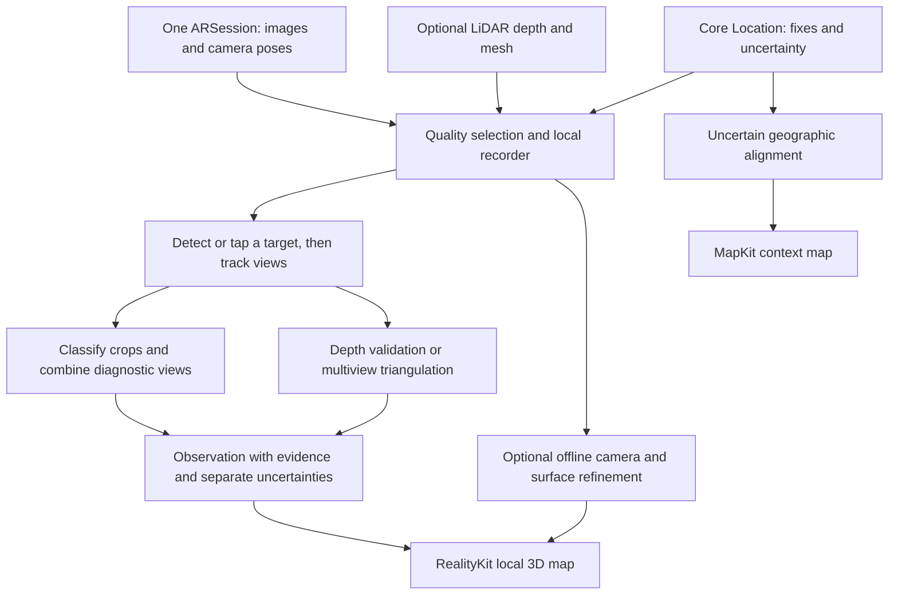

# TerraMesh: recommended first architecture

Research date: September 10, 2026. The goal is a native iPhone app that records a walk, identifies biodiversity with useful capture guidance, and puts observations into a usable 3D habitat map. Hardware features are optional enhancements. This document recommends a build and validation path; no app, species classifier, or 3D reconstruction has been benchmarked on the samples yet.

Implementation update: a native prototype now exists in ios/. It implements the capture/evidence foundation, provisional point placement, and limited model inference; see verification for completed software checks. The broader architecture below remains a roadmap, and its field accuracy gates remain untested.

Photogrammetry update: a separate local video reconstruction pipeline now produces a textured preview from the supplied curb clip and registers all 163 sampled images. Experiment results preserve independent sparse models, camera evidence and artifact checks. This is not yet integrated into iPhone capture, and its metric scale, joins and geographic alignment remain unverified.

Live guide update: the native app now combines general scene-region proposals, short-lived 2D tracking, broad semantic descriptions and hierarchical iNaturalist sample-model suggestions. Live capture guide explains the red/yellow/green behavior and exact-frame evidence saving. Green means consistent model suggestions requiring review; it never automatically grants Research Grade. This is a limited candidate pipeline, not verified detection of every organism or litter item.

## Recommendation

Build **SwiftUI + ARKit + Core Location + Vision/Core ML + RealityKit**, with a local recording package as the foundation. Use ARKit's camera-and-motion tracking to build a local metric map; add LiDAR depth and a coarse mesh when available. Detect candidate organisms, save diagnostic images, and locate each observation using trustworthy depth or multiple viewpoints. Add selective desktop/server photogrammetry afterward.

The first useful result is a walk trajectory and clickable 3D observations with evidence, uncertainties, and partial habitat geometry. Detailed textured surfaces can follow. This makes it possible to deliver the user's main goal without waiting for a complete photogrammetric model of moving, occluded vegetation.

**Do not integrate acceleration twice to estimate the route.** ARKit already combines camera and inertial measurements through visual-inertial odometry. Core Motion can record optional diagnostic telemetry, but a custom inertial-navigation implementation is unnecessary for the first version. [Apple world tracking](https://developer.apple.com/documentation/arkit/understanding-world-tracking)

## What the supplied videos establish

I inspected 36 evenly spaced preview frames across three videos. Their combined duration is **268.530 seconds**, with **16,106 declared video frames**, cross-checked against independent streamed packet counts. All report an iPhone 13 Pro Max and portrait-displayed 4K HEVC video at approximately 60 fps.

| Sample | Practical implication |
|---|---|
| Beach sand and stranded material | Low/repeating texture tests tracking; close evidence is needed to distinguish organisms, detached material, and debris. |
| Boardwalk with dense vegetation | Rigid rails help tracking but can intercept depth intended for a plant; vegetation often needs patch-level observations. |
| Curb with grass and separated low plants | Best first controlled pilot: stable curb geometry, some visually separable plants, and opportunities for short multiview captures. |

The files are useful RGB baselines. No documented AR pose/depth package or explicit GPS tag was recovered by the inspection; proprietary metadata remains partly undecoded. They do not establish live performance, metric accuracy, or species accuracy. See sample assessment and machine-readable verification.

## The recording experience

1. **Start survey.** Open the camera immediately, create a local session, and record the first available location with its timestamp and uncertainty. Local capture should work while GPS is unavailable or inaccurate; geographic placement can improve later. Keep recording in the foreground and checkpoint on interruption.
2. **Walk and scan.** Display the route, saved observations, visible surface coverage where supported, and one actionable cue. Select sharp, overlapping views automatically. A direction with no valid geometry should remain unobserved.
3. **Notice an organism.** Offer a candidate outline from a lightweight detector/region proposer. Let the user tap an overlooked subject. The detector's job is to find an observation, while the classifier's job is to name it.
4. **Improve the evidence.** Request a closer view, whole organism, flower/leaf detail, steadier image, or a lateral step depending on the actual missing evidence. Obtain detail stills through the active AR session where supported. A species-level answer is not always possible from photographs.
5. **Save and review.** Save the best supported taxon, a point or patch when justified, the images, and time. Let the user inspect the spatial map and correct or merge observations. An unresolved observation remains available for later review.
6. **Finish.** Show an immediately usable local map. Optional processing can refine camera positions and selected surfaces, then publish a new geometry version while retaining original evidence.

Apple supports high-resolution still capture within an ARSession, including camera pose and related frame information. This provides a cleaner implementation than attempting to run a competing capture session for detailed photos. Feature-check the active format and use the returned still frame's own calibration. [Apple high-resolution AR capture](https://developer.apple.com/documentation/arkit/arsession/capturehighresolutionframe(completion:))

## Capability-based support

Propose **iOS 17+** as an initial engineering floor; this is a product choice, not a LiDAR requirement or the minimum OS of every API. Confirm the oldest target hardware through a real-device prototype. Every recording declares the capabilities actually enabled.

| Capability | Baseline behavior | Enhancement when available |
|---|---|---|
| AR world tracking | Camera poses, metric local route, tracked observation views | Same foundation on all supported devices |
| No valid scene depth | Triangulate a stationary target from translated viewpoints; retain image/bearing-only evidence if that fails | LiDAR depth and confidence can support faster direct placement |
| No scene mesh | Render observation points/patches and verified local structure | Render a coarse mesh from supported reconstruction APIs |
| Limited inference resources | Lower inference frequency, prioritize selected targets, keep recording responsive | Faster inference and richer local models after benchmarking |
| No network or good GPS | Preserve local survey and queued observations | Geographic alignment and optional remote classification/refinement |
| No AR support/irrecoverable tracking | Explicitly offer a geotagged photo survey with 3D unavailable | Resume as a new segment when tracking recovers |

ARKit scene depth is LiDAR-dependent and must be queried at runtime. Its confidence varies with environmental conditions and surfaces. Built-in mesh classifications are not biodiversity classes. [Apple scene depth](https://developer.apple.com/documentation/arkit/arconfiguration/framesemantics-swift.struct/scenedepth), [depth confidence](https://developer.apple.com/documentation/arkit/ardepthdata/confidencemap)

## Architecture and execution

Use one Swift app with small services: `CaptureCoordinator`, `KeyframeSelector`, `ObservationTracker`, `TaxonomyClassifier`, `SpatialAssociator`, `SurveyStore`, and `MapRenderer`. SQLite plus append-only metadata and media files is sufficient initially. There is no need for a distributed backend before capture and observation placement work.

Run detection/classification asynchronously on downscaled copies, with bounded queues and stale-work cancellation. Start by testing a few inference updates per second; this is a tuning hypothesis, not a promised frame rate. Store selected camera frames and observation stills at useful quality. Full-resolution continuous video can be an optional export rather than the sole scientific record. Preserve required buffers briefly and release ARFrames promptly. Apple warns that retaining ARFrames can cause frame drops and degraded tracking. [Apple ARKit camera guidance](https://developer.apple.com/videos/play/wwdc2022/10126/)

Thermal control should reduce model frequency, image size, and optional mesh work before compromising capture consistency. Log the actual recording format, dropped work, tracking loss, thermal state, storage use, and active model version. Phones must be measured under sustained simultaneous capture and inference, not isolated model benchmarks.

## Getting an observation into 3D

**With usable depth:** associate a target-specific region with the corresponding depth image, reject invalid/low-confidence or mixed foreground/background samples, and back-project using calibrated intrinsics and the matching camera pose. A median depth over the entire bounding box is insufficient when a rail occludes the plant. Use a consistent target region and retain the supporting pixels/views. A marker means the observed surface point or explicitly defined patch; it does not automatically locate a plant's root or full volume.

**Without depth:** track the same physical feature on a stationary target across translated views, triangulate using camera poses, and check parallax, reprojection residual, and depth consistency. A shifting box center is not a reliable physical correspondence. A small guided sideways movement is more useful than collecting many frames from the same spot. An estimated plane intersection is acceptable only when the target demonstrably lies on that surface; never snap arbitrary plants to a ground plane.

If depth or correspondence is unreliable, preserve the camera ray and image. Mark the observation “needs another angle” and resolve it later. A moving animal needs a timestamped sighting; static triangulation cannot assume it remained in one place. Dense vegetation can be a spatial patch with taxon hypotheses instead of invented individual counts.

Store original camera/view evidence and derived positions separately. After a trajectory correction or reconstruction, recompute associations against the new geometry. Use stable observation IDs, map-version IDs, and submap IDs. Split at tracking resets; join segments only with verified overlap. Do not assume ARKit's intermediate `rawFeaturePoints` form a durable survey point cloud. [Apple feature-point limitations](https://developer.apple.com/documentation/arkit/arframe/rawfeaturepoints)

## Identification and useful uncertainty

The model pipeline should be **region proposal → target tracking → image-quality filtering → crop classification → multiview evidence → supported taxonomic rank**. Start with a narrow, declared pilot taxonomy relevant to the test environment. Widen coverage after validating detection recall and identification on real walks.

For the integration prototype, evaluate iNaturalist's publicly released small Core ML model and taxonomy against the sample organisms it actually covers. Its public repository says full species models remain private. Therefore full iNaturalist-level coverage needs an appropriate model arrangement or another validated model; it is not an API assumption. [iNaturalist model availability](https://github.com/inaturalist/model-files)

Evaluate BioCLIP-family models as optional desktop/server reference classifiers or candidates for a later smaller mobile model. Compare versions using the same held-out observations and inspect exact checkpoint licenses; a newer/larger model is not automatically better for these scenes. A plant-specific multi-image service can be an optional specialist, but does not solve all biodiversity. See biodiversity research and model choices.

Keep three distinct states visible:

| State | Example meaning | Appropriate next action |
|---|---|---|
| Identity evidence | Genus supported; species unresolved | Show diagnostic flower, leaf, or whole-organism detail |
| Local placement | Target seen but distance ambiguous | Move sideways while keeping this target visible |
| Geographic alignment | Local map coherent; GPS alignment weak | Continue local survey; improve global alignment later |

Model logits/similarity scores are not calibrated probabilities. Until field calibration exists, use explicit states such as “suggested,” “supported at genus,” and “unresolved.” If numeric confidence is introduced, calibrate it by rank and relevant field conditions on held-out observations. Preserve raw scores for debugging. Use location/season only as soft priors; retain surprising visual candidates and disclose when geographic context influenced the answer.

Do not multiply scores from neighboring video frames as independent evidence. Combine a few high-quality, meaningfully different views and test whether confidence is justified. A rule-based guidance engine can initially use blur, target size, clipping, alternative-taxon ambiguity, and geometric uncertainty. Taxon-specific diagnostic prompts require curated rules or a validated diagnostic model; classifier uncertainty alone does not reveal what anatomy is missing.

Repeated sightings should merge only with compatible spatial, temporal, and appearance evidence. Same-species neighbors must remain distinguishable. An observed-track count is not automatically an organism count, and no detection is not evidence of ecological absence.

## Persistence and repeat visits

Expected persistence at a location belongs alongside identity, current motion and geometric quality as a separate field. A loose piece of litter or detached kelp can be still long enough to map today yet be unsuitable for aligning tomorrow's visit. A large tree can supply a relatively stable trunk feature, while its foliage, branches and appearance still change. Assess the physical part actually observed; a taxon name cannot distinguish attached kelp from detached material.

The prototype now supports a user-assessed **Temporary / Seasonal / Relatively stable / Not assessed** label, saved on the observation and included in exports. These are qualitative field judgments, not estimated lifetimes, measured probabilities or automatic landmark approvals. Existing records load as not assessed. Classification does not overwrite the choice, and the choice neither changes current geometry nor deletes historical evidence.

For later repeat-survey mapping, retain a dated observation layer and a separate set of verified alignment references. Temporary observations should not be selected as references. Reidentify and geometrically check a relatively stable feature before using it; its label alone does not establish stability or correspondence. A mapped tree should not become one rigid model of every leaf and branch. Avoid assigning arbitrary expiry times to evidence.

Link repeat observations to a persistent entity only when spatial, visual and temporal evidence supports the match. Keep the original observations even when an entity moves, changes or disappears. A feature not detected on a later walk is unconfirmed until view coverage and visibility support an absence assessment. Automatic entity association, change inference and landmark selection remain future work.

## GPS and satellite anchoring

Record a **continuous GPS/location trace**, not just a start point. Fit an uncertainty-aware transform between local metric positions and geographic coordinates; keep this transform separate so GPS jitter does not deform the local scene. A single fix cannot determine north/yaw. Compass measurements and sufficiently spaced trajectory fixes can help, with their own uncertainty. Persist the altitude datum and source accuracy rather than manufacturing a precise global position. [Apple location measurements](https://developer.apple.com/documentation/corelocation/cllocation)

Use MapKit aerial/satellite imagery for context first. Satellite can help place an exposed trail, clearing, or recognizable structure in the wider landscape. It cannot supply matching views of organisms hidden below a canopy. Sentinel-2's finest bands are 10 m per pixel, so those images are useful for landscape context rather than individual-plant anchoring. Higher-resolution aerial imagery still needs common visible landmarks and a measured registration error. [ESA Sentinel-2 specifications](https://www.esa.int/Applications/Observing_the_Earth/Copernicus/Sentinel-2/Facts_and_figures)

Apple geographic AR localization is optional: it depends on internet and provider imagery in supported areas and does not establish universal trail/forest coverage. If repeat surveys require precise absolute positions, add visible surveyed controls and independent check points as an advanced workflow. See geospatial research.

## Photogrammetry after capture

For the first offline experiment, use **COLMAP/PyCOLMAP** on selected sharp, overlapping frames: recover/refine cameras and sparse structure, then optionally densify successful static patches. Preserve AR calibration and poses as usable constraints/priors or validation inputs through an explicit adapter; full AR pose-graph fusion is not implied by a default command. Export refinements back to the observation map. COLMAP provides a conventional staged pipeline suitable for this test. [COLMAP tutorial](https://colmap.github.io/tutorial.html)

Apple Object Capture is appropriate to evaluate for isolated specimens/objects, but its guided object workflow is a poor foundation for the whole walking survey. Gaussian splats may later improve visual review but should remain a derived visualization. Learned reconstruction such as MapAnything is a later comparison using the same held-out geometric references; select the exact permitted checkpoint. None replaces measured evidence or makes hidden habitat observed. More details and verified hardware/license constraints are in reconstruction research.

## Minimal recording contract

| Record | Required contents |
|---|---|
| Survey | UUID, schema version, UTC/monotonic clock mapping, device/OS/app versions, enabled capabilities, camera configuration, taxonomy/model versions |
| Frame/keyframe | Frame ID, timestamp, original image size/orientation, camera intrinsics, camera-to-submap transform, tracking state, image reference; optional depth/confidence/calibration references |
| Location | Measurement timestamp, latitude/longitude, valid altitude and datum, horizontal/vertical accuracy, optional heading/course plus accuracy; never confuse arrival time with measurement time |
| Observation | UUID, target/track IDs, observation time, evidence frame IDs and regions, candidate taxa and rank, raw/calibrated scores with calibration version, review state, point/patch/bearing status, spatial evidence and uncertainty, user-assessed persistence at the location |
| Map version | Submaps, transform history, geometry sources and quality, geographic alignment with provenance/uncertainty, tracking discontinuities, derived observation positions |

Write batches incrementally, checkpoint atomically, checksum exported chunks, and preserve originals. Record image crop/resize transforms so a model box can be mapped back to the original camera pixels. Explicitly test ARKit axes, matrix direction, image orientation, timestamp mapping, and RGB/depth resolution differences. Do not invent numerical covariance when the underlying source only provides a categorical tracking state; store “unknown” plus the evidence until validated uncertainty estimation is implemented.

First export: a self-contained survey bundle, observation CSV/GeoJSON for GIS, and optional PLY/GLB geometry with an explicit coordinate sidecar. GeoJSON only contains valid geographic coordinates; local-only observations stay in the survey bundle and must not be encoded as latitude/longitude. Remote processing, when added, can start with one job queue and versioned input/output manifests. Make jobs retryable without duplicating observations.

## Build sequence and decision gates

| Stage | Concrete deliverable | Verification before advancing |
|---|---|---|
| 1. Native recording and manual placement | Record/reopen a survey; save camera poses and evidence; tap a plant and place it using depth or guided multiview capture | Compare positions against independently measured curb/plant targets; test a non-LiDAR phone and the available Pro; interruptions preserve data |
| 2. Live identification and guidance | Automatic proposals plus tap fallback; rank-aware suggestions; view-specific prompts; linked map cards | Held-out expert-labeled observations, including unknown taxa and background; detector recall, false confident labels, duplicate tracking, and prompt usefulness |
| 3. Habitat map and optional reconstruction | Short connected plot maps, visible surfaces/patches, survey effort, exports, selected offline refinement | Withheld geometry checks; show whether refinement improves placement, not just appearance; keep failed areas unknown |
| 4. Broader field use | Longer segmented walks, larger validated taxonomy, repeat surveys, optional remote models and geographic controls | Sustained performance on minimum hardware; drift/revisit tests; calibrated confidence and documented ecological sampling protocol |

For Stage 1, propose a **20-minute uninterrupted recording test** and a **0.5 m 90th-percentile local-position-error gate for accepted stationary plant points in a small pilot plot**. Define this as 3D Euclidean error against independently measured, withheld target positions. Align the coordinate frames rigidly using separate control targets; do not fit alignment or scale on the scored plant points. These are provisional product targets, not expected performance, sensor specifications, or an absolute GPS claim. Also report the fraction of eligible observations that obtain an accepted position, so rejecting nearly every point cannot masquerade as success. Add a task-specific coverage gate once the pilot annotation is defined. Smaller organisms and crowded plants may require a tighter tolerance.

For Stage 2, initially require species-level numeric confidence to remain disabled until held-out calibration is available. Report accuracy by taxonomic rank, false accepted species IDs, abstention, detection recall, and results separated by habitat/device. Split data by organism/site/walk rather than adjacent frames. Report denominators and uncertainty intervals programmatically. A tiny pilot validates integration, not universal species performance.

Neither reconstruction nor classifier accuracy, battery performance, absolute location accuracy, or ecological completeness has been proven by this research. The next implementation should establish the native recording and spatial-placement experiment first, while the model evaluation can run independently on annotated crops from these videos.

## Supporting work

- Native iPhone capture research
- Biodiversity model and guidance research
- Geospatial and reconstruction research
- Sample assessment
- Reproducible sample inspection script
