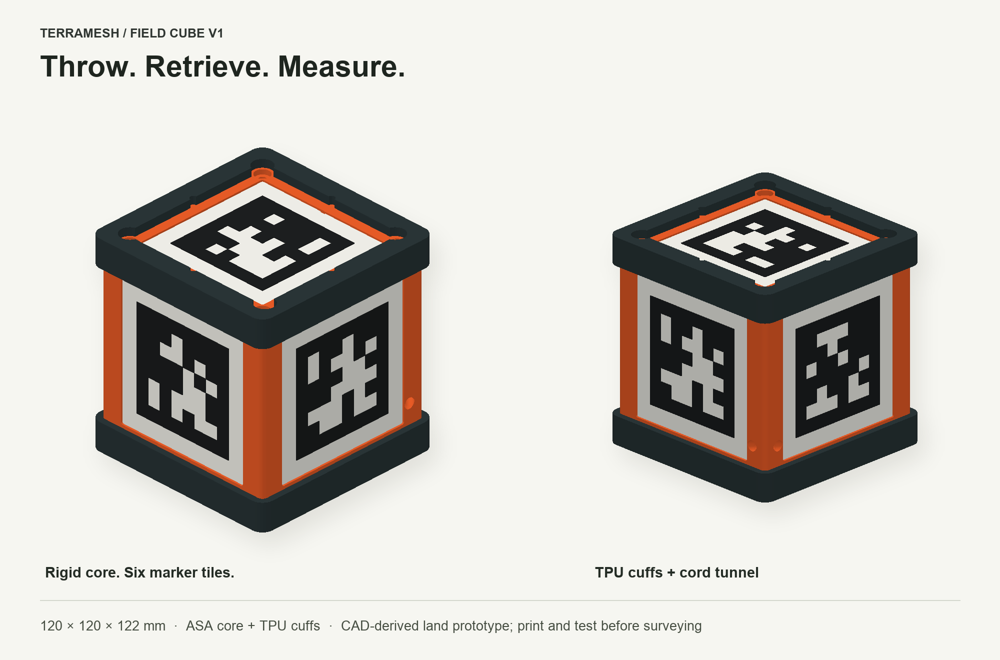

# TerraMesh Field Cube — land prototype v1

A printable photogrammetry reference for the Bambu Lab H2D: a rigid bright ASA body, two removable TPU bumpers, six replaceable AprilTag tiles and a protected retrieval-cord passage. Designed for field tossing and retrieval. Physical fit, impact resistance and survey accuracy still need prototype testing.

**Print the fit pieces first.** The finished assembly is **120 × 120 × 122 mm**, excluding cord. This release is for land; it is neither a flotation device nor a validated underwater target.

## What to print

Import STL files as **millimetres at 100% scale**. The orientation in every STL is its intended print orientation; keep the flat bottom at Z=0.

| File in `stl/` | Quantity | Material |
|---|---:|---|
| `01_body_ASA.stl` | 1 | Bright orange or yellow, ordinary dense ASA |
| `02_lid_ASA.stl` | 1 | Same ASA |
| `03_bumper_cuff_TPU_PRINT_TWO.stl` | 2 | TPU 95A, ideally a visible contrasting colour |
| `04_tag_0…` through `09_tag_5…` | 1 each | White ASA base, black ASA raised pattern |
| `11_fit_coupon_PRINT_FIRST.stl` | 1 first | ASA |
| `12_tile_fit_strip_PRINT_FIRST.stl` | 1 first | ASA |
| `13_bumper_fit_clip_TPU_PRINT_FIRST.stl` | 1 first | TPU 95A |
| `14_core_fit_rail_ASA_PRINT_FIRST.stl` | 1 first | ASA |

Optional: print six copies of `10_blank_tile_for_adhesive.stl` **instead of** the raised marker tiles and attach the supplied flat artwork. Centre each 80 mm graphic on its 84 mm tile (2 mm inset on each side), with the artwork's top toward the notch. Flat graphics avoid relief shadows but require an abrasion-resistant matte print. Their measured face offsets differ from the raised tiles.

The assembled target uses ten printed pieces: one body, one lid, two bumpers and six tiles. Test pieces are separate.

## H2D starting settings

These are proposed settings, not a completed printer-specific slice. Use the H2D's profile for your actual nozzle and filament. No G-code is supplied.

- **Body/lid:** 0.4 mm nozzle, 0.20 mm layers, five walls, six top/bottom layers and 30% gyroid infill. Body prints open side up; lid prints with its marker pocket up. Use a brim if your ASA profile needs one, without altering part dimensions.
- **TPU bumpers:** 0.20 mm layers, four walls, 20% gyroid infill. Print the broad flat ring on the bed with the sleeve opening upward. Use the appropriate TPU feed path/profile for the H2D.
- **Tiles:** 0.20 mm first layer and regular layers, no adaptive layers, 100% infill. Print white through **Z=1.20 mm**, then black for the final **0.40 mm**. Use a filament change before the first black layer (nominal layer seven), or assign colours by height in your slicer. Both colours should be the same rigid material. The complete STL contains both colours' geometry.
- **Supports:** geometry was designed to avoid large unsupported roofs. Inspect the short pocket ledges, approximately 7.5 mm captive-nut-slot bridges, cord opening and TPU bead in your actual slice. Do not blindly enable supports inside the nut slots or cord passage.

Use ordinary ASA for the rigid geometry. Keep foaming/aero filament out of this first reference prototype. TPU belongs on the bumpers, where flex does not change the marker layout. [Prusa's ASA guidance](https://help.prusa3d.com/article/asa_1809) and [flexible-material guidance](https://help.prusa3d.com/article/flexible-materials_2057) explain the underlying material choices.

## Hardware

- Four **M4 × 16 mm pan-head screws**, measured under the head. Head diameter must fit the 9 mm lid counterbores; choose heads no larger than 8 mm diameter and 3 mm tall.
- Four ordinary **M4 hex nuts**, nominally 7 mm across flats and approximately 3.2 mm thick. Do not substitute thicker locknuts without changing the pockets.
- Bright **2–3 mm retrieval cord**; passage is nominally 5 mm.
- A thin, rigid adhesive rated for your tile/body material. Test the bond on spare material first. Avoid compressible foam tape. Keep the bond line uniform and no thicker than about 0.2 mm.

## Fit and assembly

1. Test the 84 mm strip in the long channel of the fit coupon. It should sit flat without force. Check the M4 clearance hole, nut recess and cord hole with your actual hardware.
2. Slide the ASA core-fit rail onto the floor of the TPU fit clip, with its grooved edge facing the TPU bead. The bead should engage the groove without bending the rigid rail. This tests the bead/clearance; the complete closed cuff still needs its own fit check.
3. Remove strings and burrs from the body's nut slots and cord passage. Feed the cord through the two adjacent openings near the lower rear-right corner, join it into a retrieval loop, and verify that it runs freely. Keep it outside the marker faces. The cord anchor has no assigned load rating.
4. Insert the four M4 nuts through their slots from inside the open body. Fit the lid and screws. **One screw is offset, so the lid fits in one orientation.** Tighten evenly just until the rigid lid seats; do not distort it.
5. Dry-fit each marker tile. Its small notch identifies the **top of the printed pattern**. Bond the tiles flat using the face map below. Keep glue off the black/white edges and let the bond cure before handling.
6. For the bottom tile, which has no recess, use the body's centre: its edges should be 14 mm from the nominal straight body edges. Measure both directions while bonding. Do not assume hand placement has established precise inter-face coordinates.
7. Push one TPU cuff onto each end. Their inner beads seat in the shallow body grooves. The bottom cuff's ring is below the body; the top cuff is inverted over the lid. Access cutouts leave room for the lid screw heads/driver. The soft parts sit outside the structural screw stack.

The two cuffs are identical. The rigid core is 112 mm across; with both cuffs installed it is 120 mm across and 122 mm tall. No ballast is required for this first land prototype. The hollow body reduces material use.

## Face map

The cord passage is at the **rear-right** corner. Front is opposite the rear face, with the lid upward. The pattern notch points as follows:

| ID | Face | Notch direction |
|---:|---|---|
| 0 | Front | Toward lid |
| 1 | Right | Toward lid |
| 2 | Back | Toward lid |
| 3 | Left | Toward lid |
| 4 | Lid/top | Toward back face |
| 5 | Bottom | Toward front face |

Use `markers/tag-N-tile-84mm.svg` as a visual orientation reference. Marker family is **tag36h11**. The detected black square is **64 mm**, not the 84 mm tile. The notch stays outside the required white border. The internal black-cell junctions have a 0.02 mm manufacturing relief to make the STL manifold; the outer detected square remains 64 mm.

## Before using it as a reference

Measure each finished black square horizontally and vertically, check flatness/diagonals, and record the actual assembled marker positions. `markers/nominal-target.json` contains nominal design coordinates in millimetres and the OpenCV canonical corner order. It is **not measured calibration**. Its bottom marker is deliberately farther from the core centre than the other faces; do not replace the layout with a symmetric perfect cube. Adhesive thickness and replacement tiles change the real geometry.

Check every ID with a camera before and after progressive drop tests. Start with low drops onto representative ground, then inspect the cord anchor, cuffs, tile bonds, lid and dimensions before increasing impact severity. A part remaining intact does not prove that the reference dimensions remained fixed.

During capture, let the cube settle and leave the cord slack. Keep the whole white border visible; aim for views within roughly 45° of a useful face's normal where practical. The protective cuffs can hide part of the white border at very oblique angles. Use several faces and positions, and include an independently measured distance elsewhere in the scene to check the reconstruction.

This package provides the physical target and nominal geometry. Automatic detection and scale constraints still need to be integrated into the reconstruction software; this task does not add that functionality to the TerraMesh app.

## Files, verification and provenance

- `source/field_cube.scad`: editable mechanical source. Dimensions and face transforms are coupled; after edits, regenerate both CAD and matching marker coordinates.
- `source/export_stls.py`: sequential OpenSCAD exporter.
- `source/generate_markers.py`: reproducible graphics from cached upstream data.
- `source/verify_geometry.py`: mesh, assembly and actual-STL marker checks.
- `verification/geometry-report.json`: exact checked file hashes and results.
- `markers/verification.json`: separate marker artwork/orientation checks.
- `preview/`: accurate views rendered from the exported meshes; hardware and cord are omitted.

Existing principles: [AprilTag](https://github.com/AprilRobotics/apriltag), [OpenCV marker geometry](https://docs.opencv.org/4.x/d5/dae/tutorial_aruco_detection.html), [NIT Aprilcube](https://github.com/ovgu-nit/nit_aprilcube), and [NASA's photogrammetry cube](https://ntrs.nasa.gov/citations/20090022216). The mechanical CAD here is a new design; it does not copy the NIT mechanical files. Marker data retains its upstream licence in `markers/LICENSE-apriltag-imgs.txt`. Original mechanical design is provided under [CC BY 4.0](https://creativecommons.org/licenses/by/4.0/).
